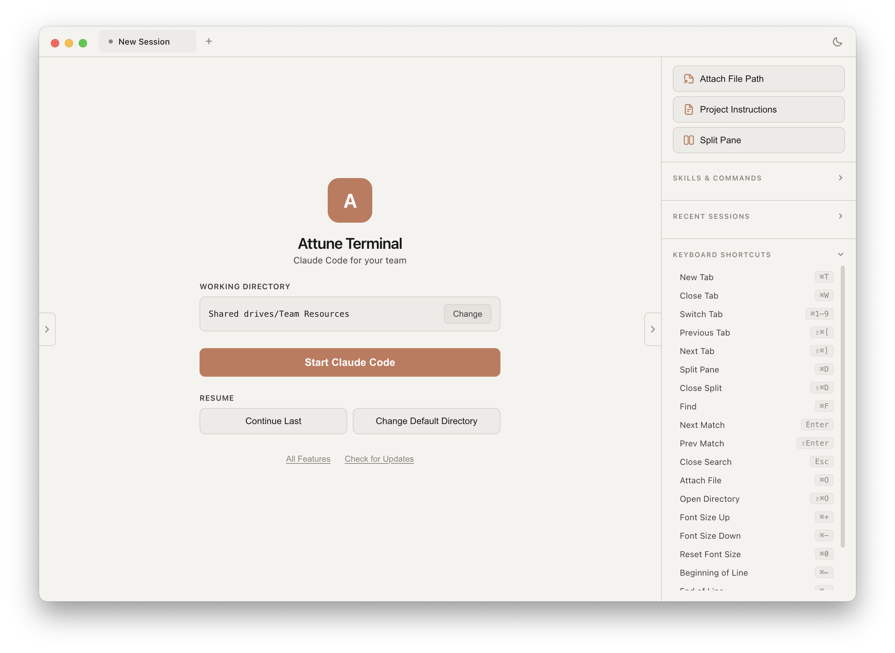
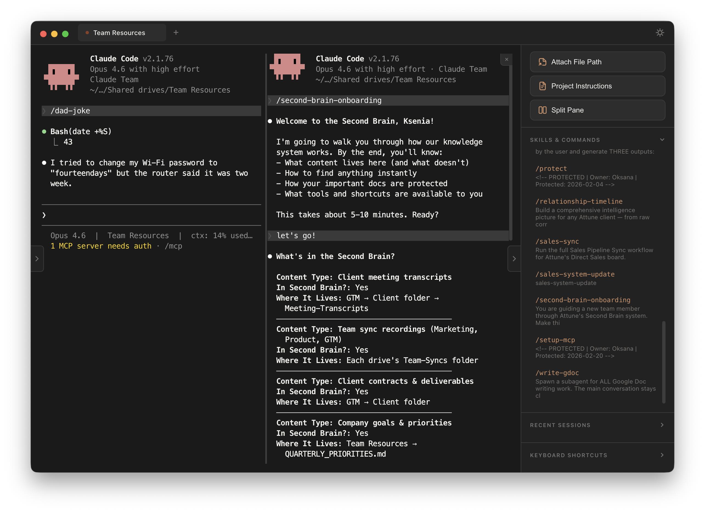
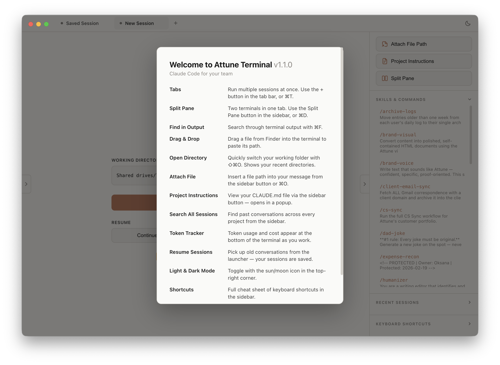

# Attune Terminal

A macOS desktop app for Claude Code. Built with Electron, Attune Terminal wraps Claude Code in a polished GUI with tabs, split panes, session management, notifications, and a feature-rich sidebar.







## Installation

Download the latest `.dmg` from [Releases](https://github.com/ksenias-bugs/attune-terminal/releases).

**First launch on macOS:** Since this app is distributed outside the App Store, macOS may ask you to confirm. To open:
1. Double-click the .dmg and drag Attune Terminal to Applications
2. Open Finder, go to Applications, right-click Attune Terminal and select "Open"
3. Click "Open" in the dialog that appears
4. You only need to do this once — after that it opens normally

**Prerequisites:** Attune Terminal runs Claude Code inside a terminal, so you need:
- [Claude Code](https://docs.anthropic.com/en/docs/claude-code) installed and authenticated
- macOS (Apple Silicon)

## Features

- **Tabs** -- open multiple Claude sessions side by side (Cmd+T to open, Cmd+W to close, Cmd+1-9 to switch)
- **Split panes** -- run two terminals in the same tab (Cmd+D to split, Shift+Cmd+D to close)
- **Session persistence and resume** -- tabs save on close and restore on relaunch with a one-click resume button
- **Cross-directory session search** -- find and resume any past Claude session across all your projects
- **Smart scroll** -- scroll up freely while Claude is working; auto-scrolls to bottom on new output when you are at the bottom
- **Dynamic skills sidebar** -- auto-discovers slash commands and skills from your .claude/ directory
- **File explorer** -- browse project files in a collapsible left panel with drag-and-drop path insertion
- **Find in terminal** -- search terminal output with Cmd+F, navigate matches with Enter/Shift+Enter
- **Native macOS notifications** -- get notified when Claude needs approval or finishes a task (dock bounce for approvals)
- **CLAUDE.md preview** -- view your project instructions directly from the sidebar
- **Light/dark theme toggle** -- switch between light and dark themes from the tab bar
- **Auto update check** -- checks GitHub for new releases on startup
- **Adjustable font size** -- Cmd+Plus to increase, Cmd+Minus to decrease, Cmd+0 to reset (range: 10-28px)
- **Window position memory** -- remembers your window size and position across launches
- **Keyboard shortcuts reference** -- full shortcut list available in the sidebar
- **Configurable default directory** -- set your preferred working directory on first launch; change it anytime from the launcher
- **Recent directories** -- quick access to your most recently used project directories

## Getting Started

### Prerequisites

- macOS
- Node.js 18+
- npm
- [Claude Code CLI](https://docs.anthropic.com/en/docs/claude-code) installed and authenticated

### Install and Run

```bash
git clone https://github.com/ksenias-bugs/attune-terminal.git
cd attune-terminal
npm install
npm run start
```

On first launch, you will be prompted to set your default working directory. This is where new tabs will open by default.

## Building for Distribution

```bash
npm run dist
```

This produces a `.dmg` installer in the `out/` directory. The build targets Apple Silicon (arm64) by default.

## Tech Stack

| Component | Version |
|-----------|---------|
| Electron | 33 |
| xterm.js | 5.5 (@xterm/xterm) |
| node-pty | 1.0 |
| esbuild | 0.24 |
| node-notifier | 10 |

Additional xterm addons: fit, search, web-links, webgl.

## Keyboard Shortcuts

| Action | Shortcut |
|--------|----------|
| New Tab | Cmd+T |
| Close Tab | Cmd+W |
| Switch to Tab 1-9 | Cmd+1 through Cmd+9 |
| Previous Tab | Shift+Cmd+[ |
| Next Tab | Shift+Cmd+] |
| Split Pane | Cmd+D |
| Close Split | Shift+Cmd+D |
| Find in Terminal | Cmd+F |
| Next Match | Enter (while search is open) |
| Previous Match | Shift+Enter (while search is open) |
| Close Search | Esc |
| Attach File Path | Cmd+O |
| Open Directory | Shift+Cmd+O |
| Font Size Up | Cmd+Plus |
| Font Size Down | Cmd+Minus |
| Reset Font Size | Cmd+0 |
| Beginning of Line | Cmd+Left |
| End of Line | Cmd+Right |
| Delete Line Backward | Cmd+Backspace |
| Delete Line Forward | Cmd+K |

## Project Structure

```
attune-terminal/
  src/
    main.js            # Electron main process (IPC, PTY, config, notifications)
    preload.js         # Context bridge for renderer
    renderer/
      index.html       # App shell and layout
      app.js           # Tabs, launcher, session management, split panes
      terminal.js      # xterm.js setup, themes, scroll behavior, search
      sidebar.js       # Skills, sessions, shortcuts panel
      file-explorer.js # File tree browser
      styles.css       # All styles (light and dark themes)
  scripts/
    build.js           # esbuild bundler config
  assets/
    icon.icns          # App icon
```

## License

Proprietary. Internal use only.
